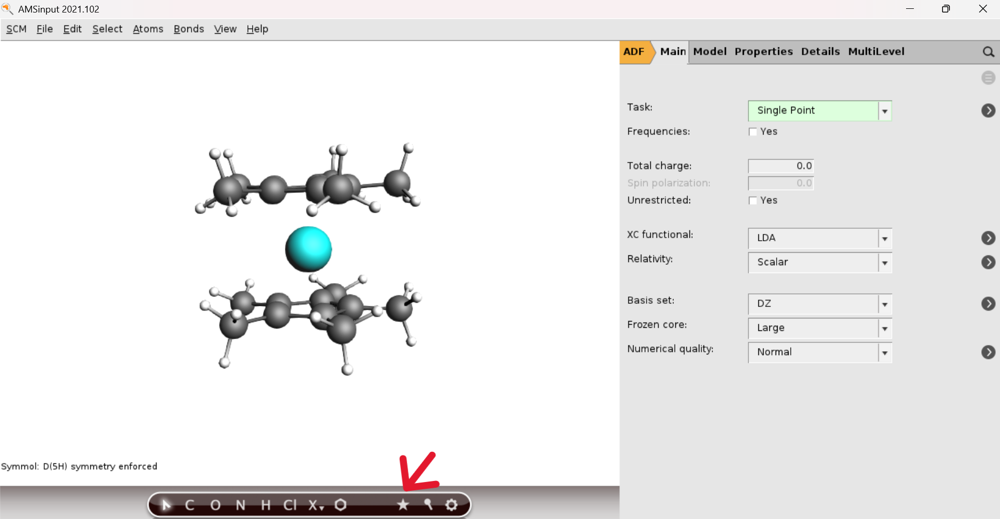
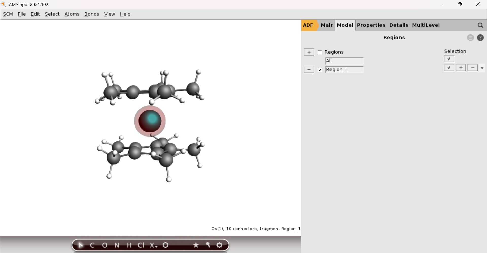
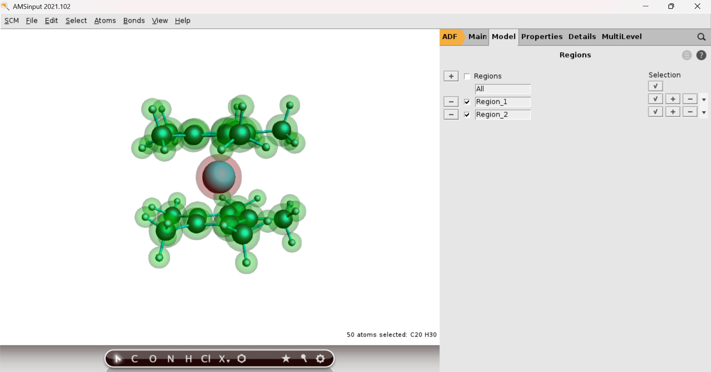
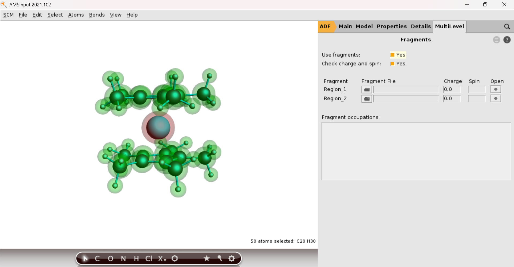
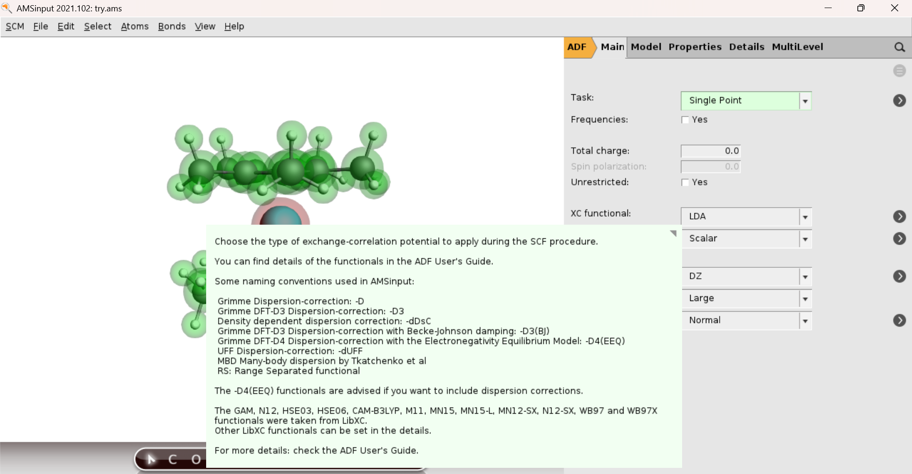
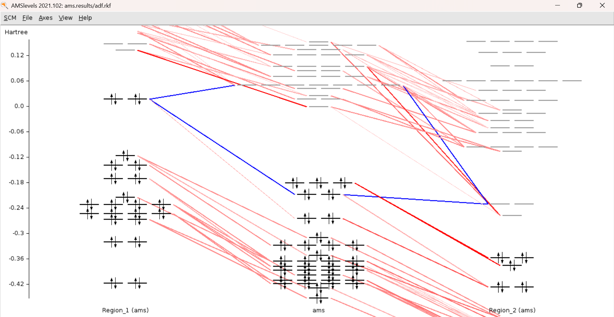
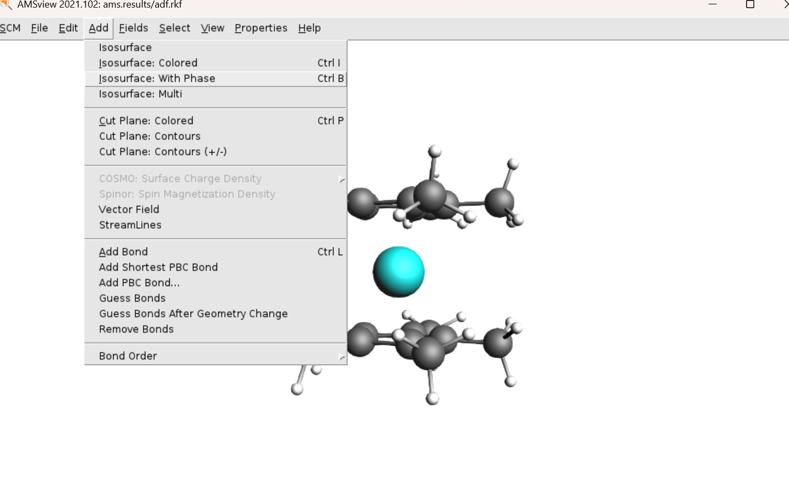

This tutorial demonstrates how to perform fragment analysis of **osmocene** using AMS-2021 (ADF engine) on the IPC cluster ("troglodyte"), leveraging the AMS-GUI tools AMSINPUT and AMSVIEW for job setup and visualization respectively.

## Getting Started
### 1. Software Initialization
- Log in to IPC cluster via `ssh -X username@ip-address`.
- Activate ADF environment: `setupadf-v21`.
- Launch AMSInput GUI: `amsinput &`. Allow some time for the GUI to fully load.

### 2. Importing Molecular Coordinates
- Prepare an `.xyz` file with your molecule's coordinates, e.g., [osmocene.xyz](ADF-files/osmocene.xyz)
- In AMSInput, navigate to File → Import Coordinates, locate and select your `.xyz` file.
  

### 3. Defining Fragments
- Deselect all atoms by clicking on empty space. Use the star icon to attempt symmetry assignment.
 
- Select atoms for Fragment 1 (e.g., Os in osmocene). For multi-atom fragments, use manual selection or Ctrl+D to expand the selection.
- Check selected atom count in the bottom right graphics pane.
- Go to Model → Regions, click `+` to create Region_1 (e.g., Os in red).
   
- For Fragment 2, use Select → Invert selection and add another region, Region_2.
 

### 4. Specifying Fragment States
- In Main → Task → Single Point; click the arrow at Task to access the Fragments page, or via MultiLevel → Fragments.
- Check "Use Fragments", and set charge and spin as needed (e.g., singlet, triplet, or as desired).
   
- For example, consider osmocene with both fragments assigned a neutral charge and a triplet state. In this configuration, one fragment should have an alpha spin and the other a beta spin so that the unpaired electrons compensate, ensuring that the total molecule remains in a singlet state.
 
Note that in this case, the calculation will run in unrestricted mode. Be sure to check the 'Unrestricted' box in the Main settings; if it is not selected manually, the program will usually enable it automatically.
- We can explore different electronic states of the fragments by varying their charge and spin states, then compare the resulting energies. The most accurate fragment description corresponds to the electronic state with the lowest orbital interaction energy, indicating that the fragments are in their most stable states.

### 5. Calculation Setup
- Select method: Main → XC functional for your choice of DFT; set Relativity, Basis, Frozen core, and Numerical quality. Mouse over keywords for tooltips.
 
- For EDA, go to Properties → ETS-NOCV.
- When ready, File → Save As...  
  This exports files for regions and whole molecule: `$filename.ams`, `$filename.pid`, `$filename.run` (only `.run` files are needed for actual jobs).
- Close AMSInput GUI to continue via terminal.

### 6. Running Calculations

- Edit `.run` file: remove all lines before and including the line `"$AMSBIN/ams" << eor"` and also delete the ending `eor` line.
- Organize files by moving corresponding .run files into respective folders: Region_1, Region_2, and whole-molecule.
- Submit jobs using: `qadf -v21 -time 90:0:0 -ppn 8 ams $filename.run $filename.out`
(max. 96 hr, max 8 CPUs per job)
- **Do not submit jobs from GUI**. Use the terminal and queue to avoid running on cluster master node.
- Run fragment jobs sequentially. After each fragment finishes, copy its `adf.rkf` from its `ams.results` folder into the final calculation folder as `Region_1.rkf`, and `Region_2.rkf`, as referenced in the `.run` file.
- Submit the whole molecule calculation, check status with `qstat`.

### 7. Visualizing Results
- After completion, launch AMSView GUI: `amsview &` (ensure `setupadf-v21` loaded already).
- File → Open → select the `adf.rkf` for the final calculation from its `ams.results` folder.
- For interaction diagrams: SCM → Levels.
 
- Change energy units: Axis → Unit → eV.
- To visualize any orbital: right-click on a level and select its number, or use Add → Isosurface: With Phase (A tab will appear at bottom of the screen, select your choice of isosurface).
 

### 8. Energy Decomposition Analysis (ETS-NOCV)

- The EDA and NOCV analysis appear in the `.out` file of the full molecule calculation, reviewable in terminal or any text editor.

---

For more tutorials and advanced examples, visit the [AMS official tutorials](https://www.scm.com/doc/Tutorials/IndexByEngine.html#adf).

