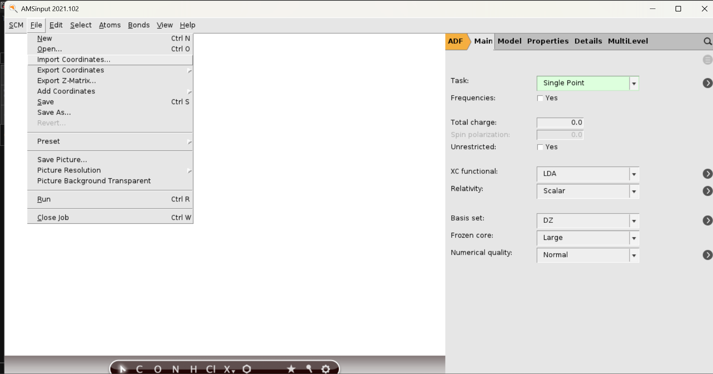

In the IPC cluster (troglodyte), AMS-2021 is already installed and running. We will use the AMS-GUI utility AMSINPUT for the generation of input files (.run, .ams) and AMSVIEW for visualisation of output file (.rkf).

Let us understand the software with an example of fragment analysis of osmocene with the following steps:
1. Software Initiation:
    1. Login to the IPC cluster; **ssh -X username@ip-address**
    2. type **setupadf-v21** to initiate the ADF environment.
    3. **amsinput &** to open the amsinput gui. It will take some time for the GUI to appear fully.
3. Importing xyz file:
    1. Create an xyz file with coordinates of your choice of molecule. Example: [osmocene.xyz](ADF-files/osmocene.xyz)
    2. In amsinput GUI, Go to File &rarr; Import Coordinates &rarr; in dialogue box go to the folder where xyz file is and click open
       
4. Symmetrize, if possible, and generate fragments:
    1. After importing all the atoms are selected, click on empty white place to remove selection. Click on the star icon at bottom to symmetrise the molecule to nearby symmetry.
       
    2. Click on the atoms for fragment 1, for instance Os in case of osmocene, for its selection. If there is a need of selecting more than one atom for the fragment, then the selection can be done either manually or by selecting one atom and then ctrl-D to select atom connected to it in order to expand the selection. Check the total number of atoms that are selected at bottom right in graphics to double check the selection.
    3. Click on Model &rarr; Regions and then click on + symbol, left to Regions, to create a region; you will see all the selected atoms are now in Region_1 with some color in the graphics. For instance, Os is in red in our case.
       
    4. To select the atoms for fragment 2, we can go to Select &rarr; Invert selection and then click on + symbol, left to Regions, to create Region_2. Both the fragments are now defined.
       
    5. Go to Main &rarr; Task &rarr; Single Point and then click on arrow at the end of Task line. It will take us to the fragment page, we can also reach here by going to MultiLevel &rarr; Fragments. Check the box yes for Use Fragments. In this example both fragments have even numbere of electrons and neutral, we can try other possiblity too by changing charge and spin for Region_1 and Region_2.
       
    6. For instance, osmocene with fragments in charge zero but triplet state. In that case one fragment has to have alpha spin and other one has to have beta for the two electrons to cancel out and maintain singlet state for the whole molecule. 
       
       Remember in this case, the overall calculation will be in unrestricted mode, check the unrestricted box in Main (if not checked, by default the program will check that box).
    7. We can try different electronic states of the fragments (charge and spin variation) and then compare their energetics. The best fragment electronic description will have least orbital interaction energy as the fragments are already in stable state.  
  
5. Setting up the calculation:
    1. Once the fragment are described, the next task is to choose the method. go to Main &rarr; XC functional and choose the DFT functional of your choice; Similarly set the other parameters, i.e., Relativity, Basis set, Frozen core, Numerical quality. A brief description of these keywords will appear as you move cursor to the box next to these keywords.
       
    2. To do EDA, Go to Properties &rarr; ETS-NOCV.
    3. After selecting any other interesting properties that you want, go to File &rarr; Save As.. 
    4. It will generate 9 files in total, three for each regions and three for the whole molecule with the extension $filename.ams, $filename.pid, and $filename.run. Only the run files are needed for the calculations.
    5. Once saved, close the amsinput gui and go to the active session in the terminal. Go to the location where the files are saved.
6. Running the calculation:
    1. View the .run file (either in terminal or in notepad) and delete the lines before ""$AMSBIN/ams" << eor" and also this one. Go to the end of the file and delete line with keyword "eor". 
    2. Make three folders, two for the fragments and one for the whole molecule. Move the .run file corresponding to Region_1 and 2 to their respective folder, and move the .run file for the whole molecule to its folder.
    3. The command for submitting the adf job is "qadf -v21 -time 90:0:0 -ppn 8 ams $filename.run $filename.out"; where the time can be given at max to 96 hr, and processor has a limit of 8.
       Note: In IPC cluster, never submit job directly from the File &rarr; Run from amsinput gui. It will run in master node and will cause trouble. 
    5. First, the fragments .run file is submitted; remember to submit one by one. Once the 1st fragment job is complete, submit the .run file of 2nd fragment.
    6. After the completion of both fragments, move/copy the adf.rkf file inside the folder ams.results (generated as soon as calculation started) to the place where the .run file of final molecule is residing. These adf.rkf file has to be renamed to Region_1.rkf and Region_2.rkf. You can double check the name by viewing the .run file of full molecule.
    7. Once copied, submit the final molecule's run file by using the above command.
    8. Use pbs commands, qstat to check the status of the job.
7. Visualizing the results:
    1. After the job completion, type **amsview &** to load the amsview GUI. Remember to have the **setupadf-v21** loaded already.
    2. Go to File &rarr; Open; then go to the ams.results folder of the final molecule's calculation and select the **adf.rkf** file.
    3. To Visualise the interaction diagram, go to SCM &rarr; Levels.
       
    5. The unit used in the diagram is Hartree, to change it to eV, go to Axis &rarr; Unit &rarr; eV.
    6. To visualise orbital corresponding to any level, just right click at that level and select its number. In a new window, the orbital will be loaded.
    7. Another way of loading orbitals or NOCV def densities is go to the AMSview GUI and go to Add &rarr; Isosurface: With Phase. A tab will appear at bottom of the screen, select your choice of isosurface.
       
8. The ETS-NOCV result:
    1. The EDA analysis and the NOCV orbital description will appear in the .out file of the full molecule. It can be viewed directly in the terminal or in the notepad.
  
For further readings and tutorials, visit [AMS website](https://www.scm.com/doc/Tutorials/IndexByEngine.html#adf)   

