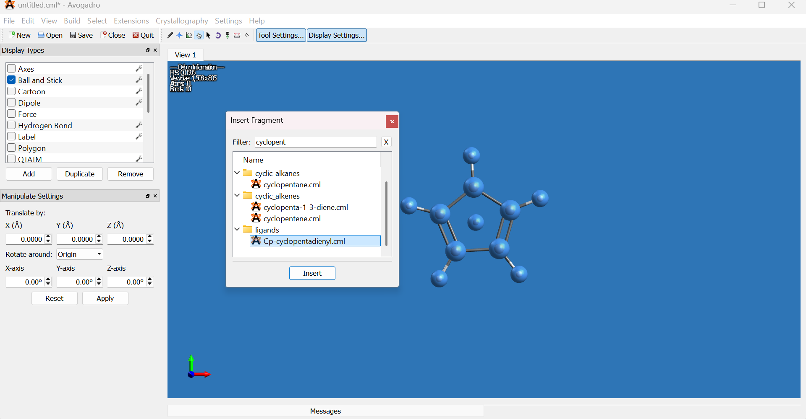
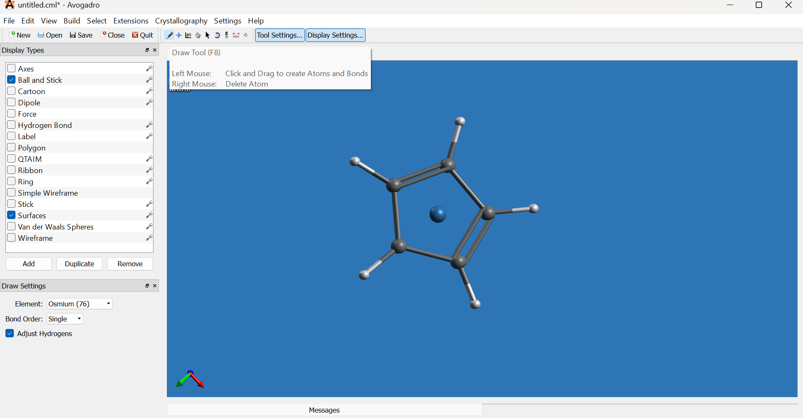
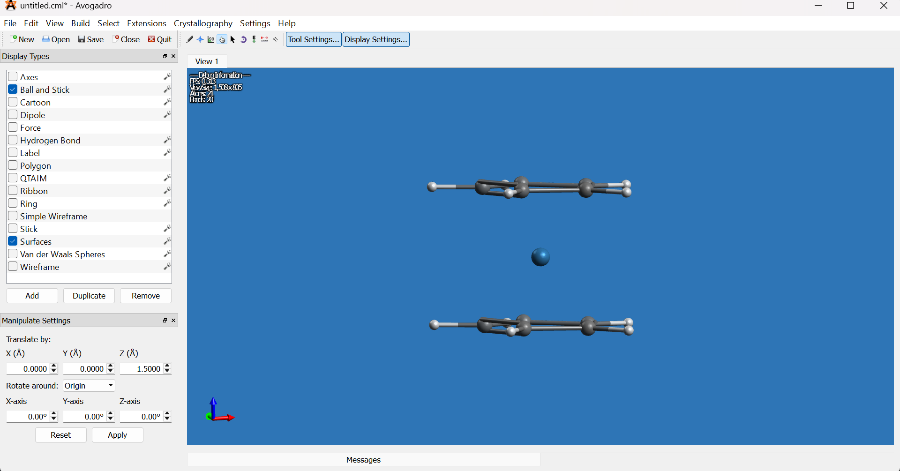

This tutorial demonstrates how to generate Gaussian input files for **Osmocene** using Avogadro 1.2.0 and prepare a geometry optimization job with DFT (B3LYP/LANL2DZ). The process includes molecule building, editing, and input generation via the Avogadro graphical user interface.

## Getting Started

### 1. Install and Launch Avogadro
- Download Avogadro from the [official website](https://avogadro.cc/).
- Run the installer and complete the setup.
- Launch Avogadro.

> **Note:** Avogadro provides several essential tools such as Draw, Navigation, Manipulation, and Selection to build and edit molecules. These tools appear in the toolbar by default; if they are not visible, enable them by going to `Settings → Toolbars` and checking the "Tools" option. For detailed descriptions and usage instructions, see the [Avogadro tools documentation](https://avogadro.cc/docs/tools/draw-tool/).
  
### 2. Building the Osmocene Molecule
- Navigate to `Build → Insert → Fragment`.
- Search for `cyclopentadienyl` and insert the fragment into the workspace.  

  

- Copy the fragment using `Edit → Copy` (or `Ctrl+C`).
- Paste the copied fragment with `Edit → Paste` (or `Ctrl+V`). The new fragment will overlap the original and remain selected.
- Translate one cyclopentadienyl ring approximately 3.0 Å along the Z-axis using the Translate option in the Manipulate Settings panel.  

  

- If the Manipulate Settings panel does not appear, enable it via `Settings → Toolbars → Manipulate Settings`.
- Deselect all fragments (`Select → Select None` or `Ctrl+Shift+A`).
- Switch to the Draw tool, set the element to osmium (Os) from the element selector on the left bottom, then click one of the dummy atom in the middle of the rings to replace it with osmium.  

  

- Select the Manipulation tool (hand icon) and rotate the molecule to view it from the side.  

  

- Using the Selection tool (arrow icon), select the remaining dummy atom and delete it.
- Select the osmium atom, then use the Manipulation tool to center it between the two cyclopentadienyl rings along the Z axis.  

  

- Deselect all (`Select → Select None` or `Ctrl+Shift+A`) and rotate to inspect the molecule from your preferred angle.  

  

### 3. Generating Gaussian Input
- Go to `Extensions → Gaussian`.
- In the Gaussian input dialog:
  - Set the **Title** to the molecule name (e.g., osmocene).
  - Set **Calculation** to Geometry Optimization.
  - Set **Method** to DFT (B3LYP).
  - Set **Basis Set** to LANL2DZ.
  - Adjust any additional keywords or options as necessary.
- Click **Generate** to produce the Gaussian input file.  

  

> **Note:** There is no strict rule for choosing the DFT method or basis set. Refer to benchmarking studies and literature for your particular system to improve reproducibility.  
> Useful references:  
> 1. [Overview of DFT methods](https://manual.q-chem.com/5.0/sect-DFT.html)  
> 2. [Best-Practice DFT Protocols](https://onlinelibrary.wiley.com/doi/10.1002/anie.202205735)  
> 3. [GMTKN55 Benchmark Database](https://goerigk.chemistry.unimelb.edu.au/research/the-gmtkn55-database/)


### 4. Submitting Gaussian and ORCA Jobs on Clusters

- Connect to the HPC clusters using SSH with X11 forwarding enabled:  
`ssh -X username@ip-address`

Available clusters and their IP addresses:  
- IPC: `10.44.82.80`  
- Tsunami2: `10.44.82.85`  
- Tsunami3: `10.44.82.86`

- **Gaussian job submission:**  
- On IPC cluster, run:  
  ```
  g16c -intel -time 96:0:0 filename.com
  ```  
  or  
  ```
  g09d -intel -time 96:0:0 filename.com
  ```  
  (Maximum runtime: 96 hours)  
- On Tsunami2 and Tsunami3 clusters, run:  
  ```
  g16c filename.gjf
  ```  
  or  
  ```
  g09d filename.gjf
  ```

- **ORCA job submission:**  
- On IPC cluster, execute:  
  ```
  qorca -intel -v4 -time 96:0:0 filename.inp filename.out
  ```  
- On Tsunami2 and Tsunami3 clusters, use:  
  ```
  qorca5 filename.inp
  ```  
  or  
  ```
  qorca6 filename.inp
  ```

> **Note:** Adjust the filenames (`filename.com`, `filename.gjf`, `filename.inp`, `filename.out`) to match your input and output file names.

### 5. Further Resources
- For detailed Avogadro documentation, visit [https://avogadro.cc/docs/](https://avogadro.cc/docs/).
- For detailed Gaussian documentation, visit [https://gaussian.com/videos/](https://gaussian.com/videos/).
- For detailed Orca documentation, visit [https://www.faccts.de/docs/orca/6.0/manual/](https://www.faccts.de/docs/orca/6.0/manual/).

